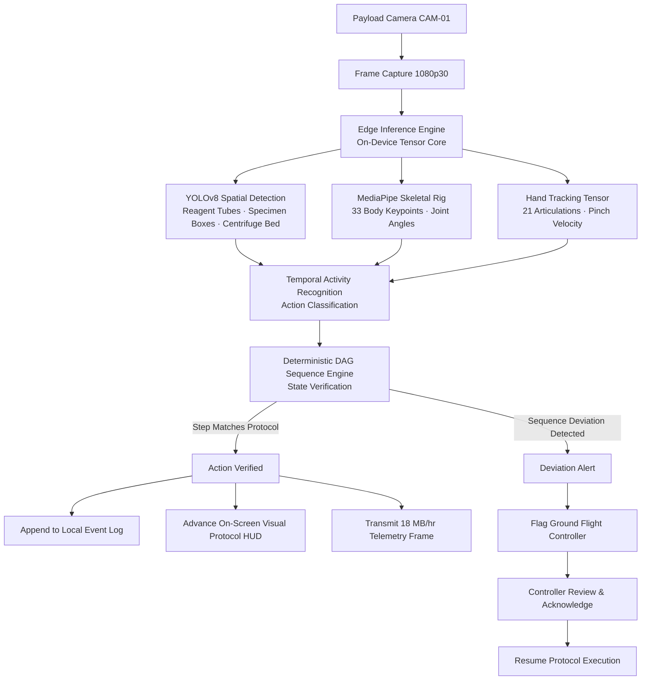
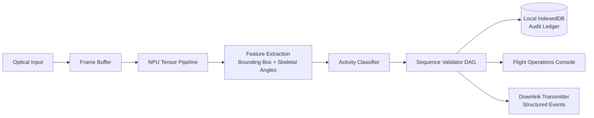

# ASTRA-HAR

**Autonomous Astronaut Activity Recognition**  
Smart India Hackathon 2026 — ISRO Problem Statement PS-26174  
Team UnoFlyp

---

## Project Overview

ASTRA-HAR is a real-time mission control console engineered to monitor astronauts conducting scientific biology experiments in microgravity aboard orbital habitats such as the International Space Station or Gaganyaan. A fixed payload optical camera feeds an on-device computer vision and temporal activity recognition pipeline. The system detects experiment apparatus, tracks 33-point skeletal keypoints and hand grip kinematics, recognizes performed actions, and deterministically validates sequence compliance against pre-defined experimental protocols.

Ground flight controllers receive structured telemetry and instant alerts when an operational deviation occurs. The astronaut receives immediate visual guidance cues on the mission HUD without audio interference, adhering strictly to ISS acoustic mitigation standards (Flight Rule Category 4).

All inference executes entirely at the edge with zero cloud dependency. Orbit-to-ground links are bandwidth-constrained and subject to communication dropouts, making cloud-tethered architectures operationally non-viable.

---

## Problem Statement

**ISRO Problem Statement PS-26174 (SIH 2026)**

Astronauts executing sensitive biology protocols must strictly adhere to step-by-step procedures. Manual paper or tablet logging consumes valuable crew time and introduces human recording errors. Real-time remote oversight by Earth-based flight directors is constrained by high round-trip latency (~600 ms) and limited shared uplink bandwidth (~10 Mbps). An undetected procedural deviation in cell culture or reagent handling can invalidate weeks of scientific data.

ASTRA-HAR addresses this challenge through automated edge activity validation, deterministic sequence audit, and compact structured telemetry transmission.

**Bandwidth Reduction:**  
Continuous raw 1080p60 video requires approximately 2.4 GB/hr per camera. ASTRA-HAR extracts semantic milestones and transmits structured JSON events at approximately 18 MB/hr, achieving a telemetry bandwidth reduction exceeding 99.25%.

---

## System Architecture

### AI Inference Pipeline



### End-to-End System Data Flow



---

## Tech Stack

| Component | Technology | Specification / Role |
|---|---|---|
| User Interface | React 18 + TypeScript | Component-driven mission control console |
| Build Tool | Vite | Sub-second Hot Module Replacement & bundling |
| Styling Engine | Tailwind CSS v4 | High-contrast glassmorphism & responsive grid |
| 3D Visualization | Three.js | Real-time illuminated 3D Earth horizon with NASA textures |
| Data Visualization | Recharts | Low-latency telemetry waveforms and system diagnostics |
| Iconography | Lucide React | Tactical flight operations iconography |
| Local Persistence | IndexedDB & LocalStorage | Offline event ledger and protocol definitions |
| Target Runtime | Modern Web Browser | 100% client-side execution, zero external API dependencies |

---

## Project Structure

```
astra-har/
├── public/
│   ├── textures/
│   │   ├── earth_atmos_2048.jpg     # NASA Blue Marble diffuse map
│   │   ├── earth_clouds_1024.png    # Atmospheric cloud layer
│   │   ├── earth_normal_2048.jpg    # Surface topography normal map
│   │   └── earth_specular_2048.jpg  # Ocean reflection specular map
│   └── favicon.svg
├── src/
│   ├── components/
│   │   ├── layout/
│   │   │   ├── CyberTopBar.tsx      # Mission navigation header & system status
│   │   │   ├── SpaceBackground.tsx  # Space environment canvas container
│   │   │   └── SpinningGlobe.tsx    # Three.js illuminated Earth backdrop
│   │   ├── live/
│   │   │   ├── CameraView.tsx       # Multi-spectral optical feed with CV overlays
│   │   │   ├── ConstellationRightPanel.tsx # Orbital telemetry & protocol compliance
│   │   │   ├── DataCentersPanel.tsx # Edge processing nodes & downlink stations
│   │   │   ├── WaveformFailurePanel.tsx    # Real-time harmonic risk waveform
│   │   │   ├── SequenceTimeline.tsx # Protocol step verification sequence
│   │   │   ├── DecisionPipeline.tsx # Step-by-step neural decision gate
│   │   │   ├── EventTimeline.tsx    # Chronological mission event stream
│   │   │   └── ExperimentLogPanel.tsx # Telemetry export and audit ledger
│   │   └── ui/
│   │       └── Primitives.tsx       # Reusable badges, buttons, indicators
│   ├── pages/
│   │   ├── MissionOverview.tsx      # Flight Director primary landing overview
│   │   ├── LiveExperiment.tsx       # Operational experiment monitoring console
│   │   ├── Protocol.tsx             # Interactive protocol builder and editor
│   │   ├── AIVision.tsx             # Neural decision DAG and keypoint inspector
│   │   ├── EventLog.tsx             # Full audit trail and anomaly log
│   │   ├── VideoStream.tsx          # Optical recording and RTSP link management
│   │   ├── SystemHealth.tsx         # Hardware drift, die temperature, and latency
│   │   └── Settings.tsx             # Persistence management and node configuration
│   ├── state/
│   │   ├── MissionStore.tsx         # Central React Context state provider
│   │   └── sim.ts                   # Deterministic telemetry and step engine
│   ├── types.ts                     # Protocol, telemetry, and event type contracts
│   ├── App.tsx                      # Root shell and tab orchestration
│   ├── main.tsx                     # React application root
│   └── index.css                    # Liquid glass tokens and typography rules
├── index.html                       # Document metadata and web font links
├── vite.config.ts                   # Vite bundler configuration
├── tsconfig.json                    # TypeScript compiler options
└── package.json                     # Dependency manifests and scripts
```

---

## Getting Started

### Prerequisites

- **Node.js**: version 18.0.0 or higher
- **npm**: version 9.0.0 or higher

### Local Development

1. Clone the repository:
   ```bash
   git clone <repository-url>
   cd astra-har
   ```

2. Install dependencies:
   ```bash
   npm install
   ```

3. Launch the development server:
   ```bash
   npm run dev
   ```

4. Navigate to `http://localhost:5173` in your browser.

### Production Build

To compile a production-ready static bundle:

```bash
npm run build
```

The output directory `dist/` contains all static assets, scripts, and pre-bundled textures, ready for deployment to any static web server or offline kiosk environment.

---

## Application Console Views

### 1. Mission Overview (Landing Console)
Primary flight director perspective providing immediate situational awareness. Displays active edge processing nodes (`Columbus Optical Ingest`, `Edge Neural Pipeline`, `ISRO Flight Ops`), live harmonic failure probability waveforms, and orbital constellation downlink tracking.

### 2. Live Console
Operational workspace for real-time protocol monitoring. Features the multi-spectral camera viewport with synthetic bounding boxes and skeletal joints, active step progression timeline, neural decision pipeline, and interactive sequence controls (**Start**, **Correct Step**, **Deviation Trigger**).

### 3. AI Vision Tree
Comprehensive neural diagnostic suite with dual operating modes:
- **Knowledge DAG Graph**: Visualizes the decision flow from optical ingestion down to bounding coordinate lattices and joint vectors.
- **Camera Optical Stream**: Side-by-side feed with active YOLOv8 entity tracking, MediaPipe 33-point joint angle readouts (elbow flexion, wrist pitch, pinch aperture), and NPU stage latency profiling.

### 4. Protocol Editor
Experiment definition interface enabling flight controllers to configure and audit step sequences, required interaction modes, target equipment identifiers, and confidence validation thresholds.

### 5. Diagnostics (System Health)
Real-time hardware performance metrics including die temperature, CPU/GPU utilization, memory saturation, inference frame rates, and automated drift stabilization alerts.

### 6. Audit Log
Chronological telemetry record with category filtering (`ACTION`, `OBJECT`, `WARNING`, `SYSTEM`) and one-click JSON export for post-flight incident review.

### 7. Optics & Video Ground Station
Manages local H.265 recording sessions, storage utilization, and network relay endpoints (`ISS Columbus LAN`, `Space-to-Ground Ka-Band`, `ISRO Bangalore Node`).

### 8. System Configuration
Hardware acceleration toggles, acoustic compliance status display, and local cache controls.

---

## Key Engineering Decisions

### 1. Zero Audio / Silent Operation
In microgravity modules, background acoustic noise from life support fans and pumps requires strict control under ISS Flight Rule Category 4. Audio alarms and speech synthesis contribute to cognitive fatigue and speech unintelligibility. ASTRA-HAR employs high-visibility on-screen HUD visual cues and status telemetry ribbons, ensuring protocol guidance remains unmistakable without generating acoustic noise.

### 2. Deterministic DAG Protocol Validation
Rather than relying solely on black-box probabilistic deep learning models to declare step completion, ASTRA-HAR routes recognized activities through a deterministic Directed Acyclic Graph (DAG) state machine. A step transition occurs if and only if both the activity classification confidence exceeds the configured threshold and the action matches the mandatory sequence graph.

### 3. Microgravity Kinematic Analysis
Standard terrestrial pose estimation fails when subjects transition between microgravity postures. ASTRA-HAR monitors relative joint flexion angles (elbow pitch, wrist attitude, torso-to-workstation grav-vector) and hand pinch aperture rather than absolute ground-plane height coordinates.

### 4. Fully Air-Gapped Asset Pipeline
All 3D globe assets (NASA Blue Marble diffuse, cloud, normal, and specular maps) are stored locally in `public/textures/`. The application requires zero internet connection to initialize and render the complete visual simulation.

---

## Team UnoFlyp

Developed for **Smart India Hackathon 2026** under **ISRO Problem Statement PS-26174**:

| Name | Role | Responsibilities |
|---|---|---|
| **Daanveer** | Project Lead / System Architect | Core state management, mission orchestration, and UI design system |
| **Krrishika** | Frontend & UX Engineer | Viewport layouts, Three.js integration, and glassmorphic styling |
| **Aditya** | AI Pipeline Simulation Lead | YOLOv8/MediaPipe simulation logic and NPU telemetry models |
| **Waseem** | Telemetry & Infrastructure | System health metrics, hardware drift profilers, and bandwidth tracking |
| **Tanishka** | Protocol Engine Specialist | DAG state validation rules and event audit logging engine |
| **Lakshit** | Video Pipeline & Optics | Video stream telemetry, recording manager, and ground station relays |

---

*ASTRA-HAR — Autonomous Astronaut Activity Recognition System • Team UnoFlyp • ISRO SIH 2026*
